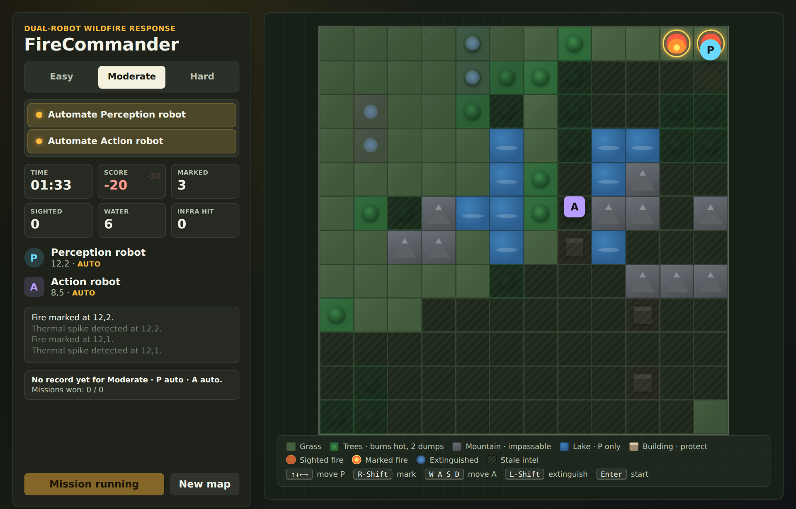
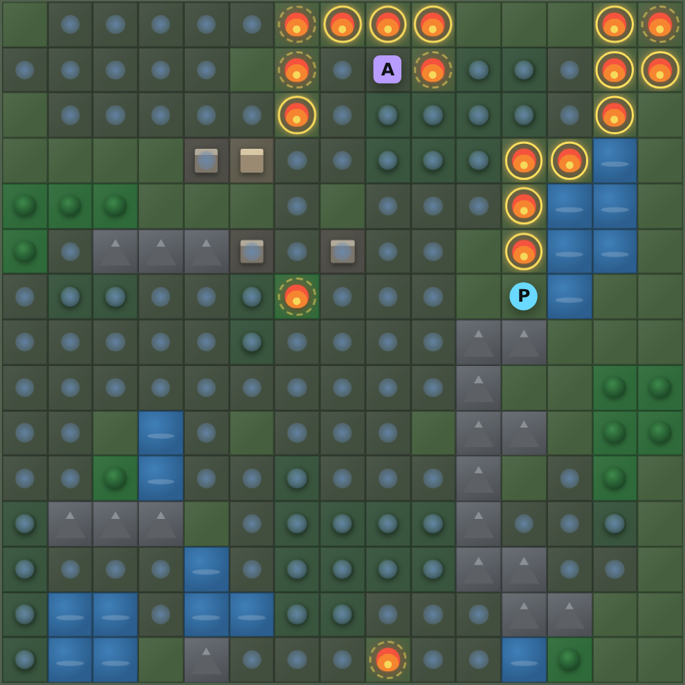
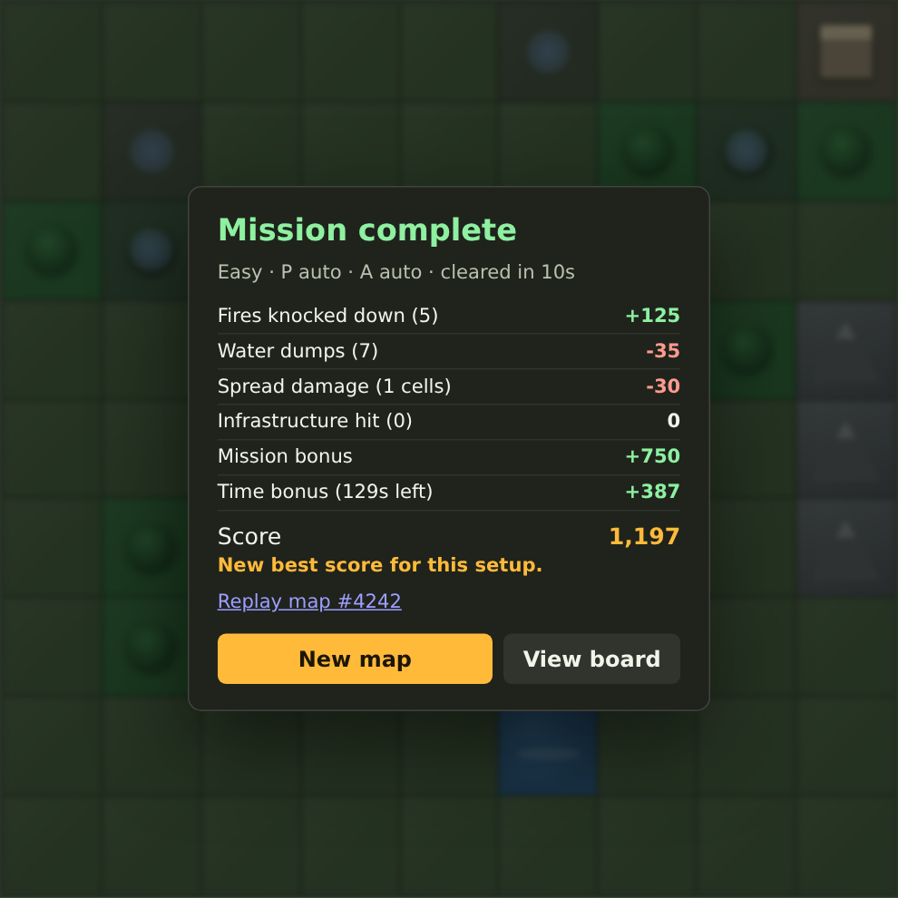

# FireCommander

A browser game about a two-robot wildfire response team. A **perception robot** flies the grid and finds fire; an **action robot** drives to it and puts it out — but only where the perception robot has *marked* it. Everything on the board is what the perception robot believes, and that belief goes stale. Mountains block, lakes stop fire, trees burn hot, and buildings must not be lost.

Plain HTML, CSS and JavaScript. No dependencies, no build step, runs from a folder.

<p align="center">
  
</p>

<table>
  <tr>
    <td width="50%" valign="top">
      
      <p align="center"><sub>Debrief on a lost Hard mission — the fog lifts and every fire is shown. Mountains and lakes held the line; the settlement did not.</sub></p>
    </td>
    <td width="50%" valign="top">
      
      <p align="center"><sub>Every mission ends with the reward broken down, a record check, and a link to replay the same map.</sub></p>
    </td>
  </tr>
</table>

## Contents

- [Play](#play)
- [Controls](#controls)
- [How a mission works](#how-a-mission-works)
- [Terrain](#terrain)
- [Scoring](#scoring)
- [Automation](#automation)
- [Difficulty](#difficulty)
- [Project layout](#project-layout)
- [Development](#development)
- [Ideas on the shelf](#ideas-on-the-shelf)

## Play

Clone or download the repository, then start a local server from the folder.

On macOS, double-click **`Play FireCommander.command`**. It starts the server and opens the game in your default browser (port 8000, or the next free one).

From a terminal, any static server works:

```bash
python3 launch_game.py          # picks a free port and opens the browser
# or
python3 -m http.server 8000     # then open http://localhost:8000/
```

Pick a difficulty, decide which robots you want to drive yourself, and press **Start Mission** (or `Enter`).

## Controls

| Key | Action |
|---|---|
| `↑ ↓ ← →` | Move the perception robot **P**. Hold to keep moving. |
| `Right Shift` | Mark the fire under **P** so the action robot can see it |
| `W A S D` | Move the action robot **A**. Hold to keep moving. |
| `Left Shift` | Extinguish the marked fire under **A** |
| `Enter` | Start the mission |

Human-controlled and automated robots move at the same fixed cadence (**P** 5 cells/s, **A** about 3.5 cells/s), so a person is never slower than the built-in policies. Taps that land inside a cooldown are queued, not dropped. One keyboard drives both robots, so playing both seats by hand is the hardest way to play; hand one robot to automation for a more relaxed mission.

## How a mission works

**P** starts top-left and **A** bottom-right. Fires are seeded on grass or trees, away from the start corners.

**P only senses the cell it is standing on.** When it scans a cell, the board shows what it saw there. That knowledge then **decays exponentially** — half-life 45 s on Easy, 36 s on Moderate, 30 s on Hard — so a cell fogs over as its intel ages. Fire that spreads into an unscanned or stale cell stays invisible until **P** goes back. The panel counts only fires **P** has marked or sighted; it never reveals how many exist.

**A can only extinguish a fire that is marked.** Standing on an unmarked fire does nothing. A marked fire stays marked until it is out.

Fire spreads every few seconds: each burning cell has a chance to ignite one random neighbour. Extinguished ground is fireproof for the rest of the mission, so knocked-down cells become firebreaks too.

Win by extinguishing every fire before the clock runs out — including the ones you have not found yet. Lose when the clock hits zero. Either way the fog lifts and the board shows everything.

## Terrain

Maps are generated randomly for every mission. The map itself is known in advance; only the fire on it is uncertain.

| Terrain | Effect |
|---|---|
| **Grass** | Burns normally. |
| **Trees** | Burn hot: 1.5× spread chance, and a tree fire takes **two** water dumps. |
| **Mountain** | Impassable for both robots. Does not burn — a natural firebreak. |
| **Lake** | **P** flies over it; **A** cannot enter. Does not burn. |
| **Building** | Critical infrastructure. Fire reaching one trips its alarm — the fire is marked automatically — and costs a large penalty. |

Every burnable cell is guaranteed reachable by the action robot (the generator retries until the map is connected). The start corners are always clear.

The summary card shows the map number. Add `?seed=<number>` to the URL to replay a specific map — handy for comparing runs or settling an argument.

## Scoring

The score is a running reward. The rule behind the numbers: **letting fire spread never pays.** A spread cell costs at least 30; knocking it down later earns 25 and costs 5 in water, so the best case is still −10.

| Event | Points |
|---|---|
| Fire knocked down | +25 |
| Water dump | −5 |
| Cell burned by spread | −30 grass or building, −45 trees |
| Fire reaches a building | −400 |
| Fire still burning at time-out | −50 each |
| Mission complete | +750, plus +3 per second left |

Spread damage is charged when **P** discovers it, or at the end of the mission for anything never found, so the live score does not leak what is happening in cells you cannot see.

Best score and fastest clear are saved in the browser per difficulty and automation setup, along with the win/loss record and last-used settings.

## Automation

Either robot can be handed to a built-in policy before or during a mission. The policies only use what the robot legitimately knows: the belief map, marked fires, and the fire status of **P**'s own cell.

- **Perception policy** — marks fire it is standing on; otherwise heads for the most valuable cell by a score of path distance, staleness, and proximity to known fire, with a strong pull toward fires that were sighted but never marked.
- **Action policy** — extinguishes the marked fire it is standing on; otherwise picks a marked fire by path distance, cluster size, age, and whether it is on or next to a building. With nothing marked, it shadows **P** so the response is short when something is found.

Both use breadth-first search over their own passability, so mountains and lakes are routed around rather than bumped into.

## Difficulty

| | Grid | Fires | Spread | Time | Intel half-life |
|---|---|---|---|---|---|
| Easy | 9×9 | 4 | 18% every 2.8 s | 2:20 | 45 s |
| Moderate | 12×12 | 7 | 30% every 2.4 s | 1:45 | 36 s |
| Hard | 15×15 | 9 | 32% every 2.4 s | 1:58 | 30 s |

Measured with both robots automated (headless, 20 maps each): the bots always clear Easy in about 15 s, always clear Moderate but need about half the clock and score anywhere from slightly negative to ~1,100, and win Hard about 60% of the time. Two bots are the strongest possible team, so each tier feels a step harder with a human in either seat.

## Project layout

```
index.html                  page layout
styles.css                  theme, board, terrain glyphs, fog, summary card
game.js                     all game logic: state, loop, terrain generator, policies, scoring, rendering
launch_game.py              zero-dependency local server (ports 8000–8999), opens the browser
Play FireCommander.command  macOS double-click launcher
tools/                      headless test and screenshot scripts (Playwright)
docs/screenshots/           images used in this README
```

## Development

The game has no dependencies. The tools do — they use [Playwright](https://playwright.dev/) to drive a headless Chromium:

```bash
npm install
npx playwright install chromium

npm run sim          # bots play every difficulty on a fast-forwarded clock; prints win rates, clear times, scores
npm test             # real-clock checks of the controls, terrain rules, summary card and persistence
npm run screenshots  # regenerates docs/screenshots on a real clock
```

`tools/sim.js` accepts `N=<runs>`, `DIFFS=easy,hard`, and an `OVERRIDE` JSON that patches `DIFFICULTIES`, `ROBOTS`, or `REWARD` for tuning sweeps without editing the game:

```bash
N=20 DIFFS=hard OVERRIDE='{"difficulties":{"hard":{"spreadChance":0.3}}}' npm run sim
```

Each simulated mission runs about two minutes of game time, so keep `N` modest per process and run difficulties in parallel. CSS transitions freeze under the fake clock, so anything visual is checked with the real-clock scripts.

`window.FireCommander` exposes the live state and configuration in the browser console for poking at.

## Ideas on the shelf

A sensing radius for **P** (it currently sees only its own cell), touch controls for the mobile layout, sound, a selectable partner skill level, and a daily map.

---

Developed by Esi Seraj, pair-programmed with Claude.
